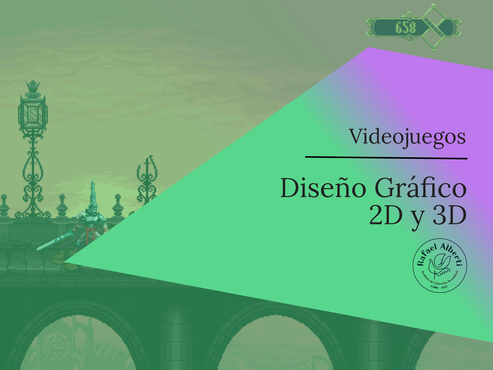

# Diseño Gráfico 2D y 3D

<section>

  

Material didáctico del módulo Diseño Gráfico 2D y 3D del CE Desarrollo de Videojuegos y realidad virtual del IES Rafael Alberti.

  

</section>

## Referencias

- [Referencias del curso](https://envasador.github.io/DG2Dy3D)

## Proyectos
- [Proyectos del curso](https://envasador.github.io/DG2Dy3D)
