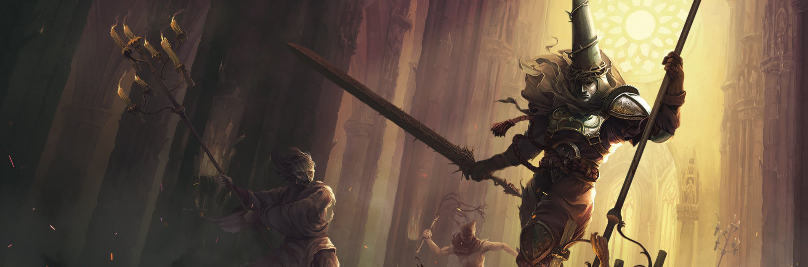

---
hide:
  - navigation
---

# Diseño Gráfico 2D y 3D

# ¡Bienvenidos al módulo de **Diseño Grágico 2D y 3D** del curso de especialización de **Desarrollo de Videojuegos y Realidad Virtual**!

Este curso está diseñado para que adquieras las habilidades necesarias en el diseño gráfico y la creación de arte en 2D y 3D, los cuales son fundamentales en el desarrollo de videjuegos.

## Tabla de contenido

* [Unidad 1: Introducción al Concept Art y Desarrollo del proceso creativo](ud1.md)

## Referencias web generales

...
